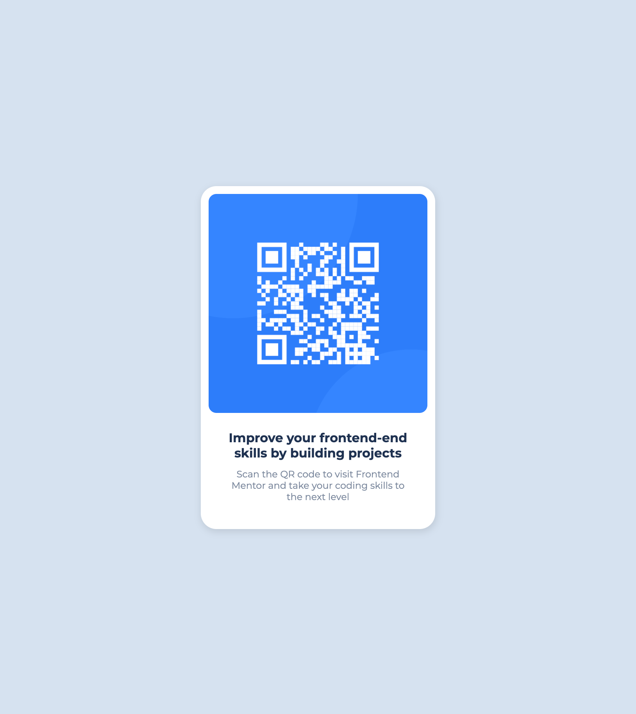

# Frontend Mentor - QR code component solution

## Overview

### Screenshot

### Links

- [live demo](https://cyh-qr-code.netlify.app/)

## My process

### Built with

- Semantic HTML5 markup
- CSS custom properties
- Flexbox

### What I learned

### Useful resources

## Author

- blog - [chenyuhao](https://chenyuhao.vercel.app)
